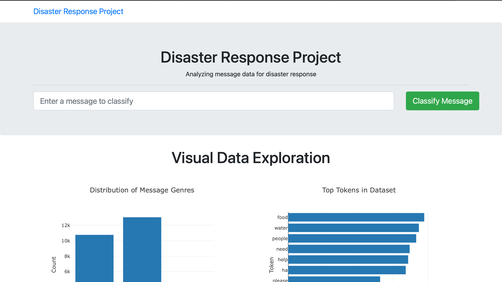

# Disaster Response Pipeline Project

## Project Motivation
This projects intends to build an ETL Pipeline with a NLP machine learning model to classify message categories to help in disaster response.

## Installation
A basic installation of the Anaconda distribution of Python is sufficient to run the notebook with Python 3.*. The modules imported are:
* numpy
* pandas
* sqlalchemy
* nltk
* sklearn

1. Run the following commands in the project's root directory to set up your database and model.
    - To run ETL pipeline that cleans data and stores in database
        `python data/process_data.py data/disaster_messages.csv data/disaster_categories.csv data/DisasterResponse.db`
    - To run ML pipeline that trains classifier and saves
        `python models/train_classifier.py data/DisasterResponse.db models/classifier.pkl`

2. Run the following command in the app's directory to run your web app.
    `python run.py`

## File Descriptions
* `app/`
  * `app/templates/`: folder containing the HTML templates of the web app
  * `app/run.py`: Python script containing the Flask code
* `data/`
  * `disaster_messages.csv`: text messages data
  * `disaster_categories.csv`: categories of the text messages (target of the multi-label classification model)
  * `DisasterResponse.db`: database file that stores the messages for the model to read
  * `process_data.py`: Python script containing the ETL pipeline
* `models`
  * `train_classifier.py`: Python script containing the model definition and training step

## Acknowledgements
Credit goes to Figure Eight for making the data available.